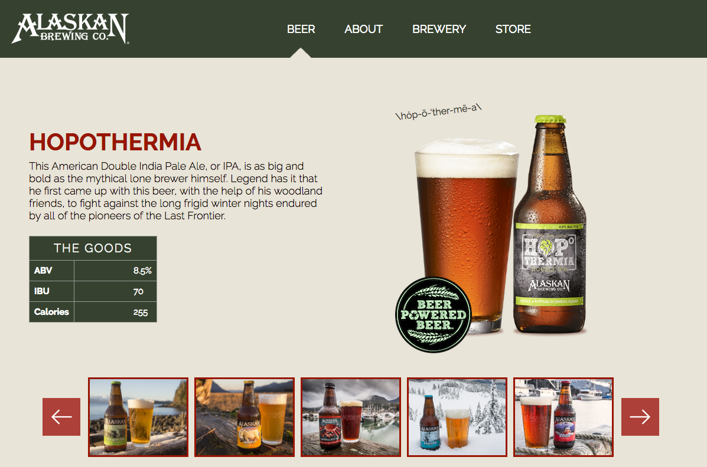

# _Beer Marketplace_

#### _CSS project for Epicodus, 11.18.2016_

#### By _**Larry Dean Tunseth II**_

## Description

_It is a simple page displaying a beer using only CSS and HTML_

## Setup/Installation Requirements

* _Clone this repository_
* _Open an HTTP server in the cloned directory_
* _Repo Link: https://github.com/larrytun/CSS_beer-market_

## Known Bugs

_No Known bugs_

## Support and contact details

_If you run into problems contact Larry Tunseth at larrydeantun@gmail.com_

## Technologies Used

_HTML
CSS
GitHub
Git_

### License

*This software is licensed under the MIT license.*

Copyright (c) 2016 **_Larry Tunseth & Epicodus_**
